#  Danh sách tính năng – DevShare Lite

---

## 1.  Đăng ký và đăng nhập

- Người dùng có thể đăng ký tài khoản bằng email và username
- Hệ thống xác thực bằng JWT và mã hóa mật khẩu bằng bcrypt

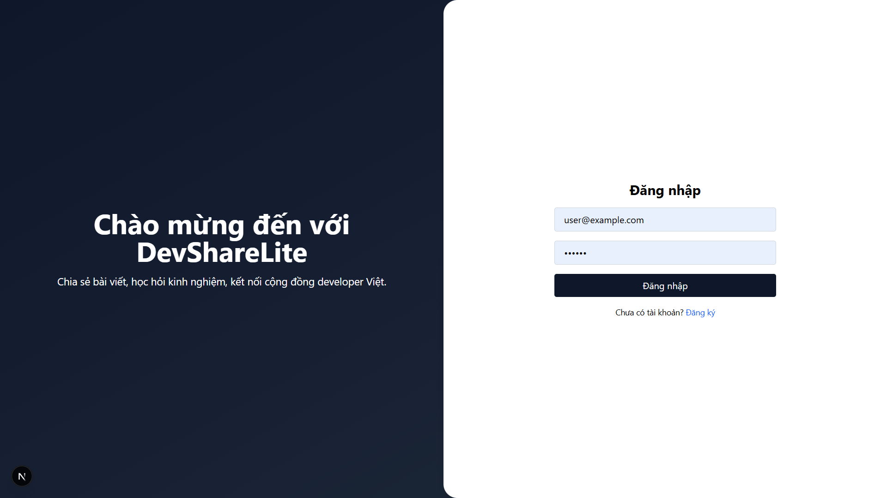

---

## 2.  Trang chủ - Danh sách bài viết

- Hiển thị các bài viết mới nhất từ tất cả người dùng
- Hỗ trợ tab lọc bài viết: "Following", "Latest", "Bookmarks"

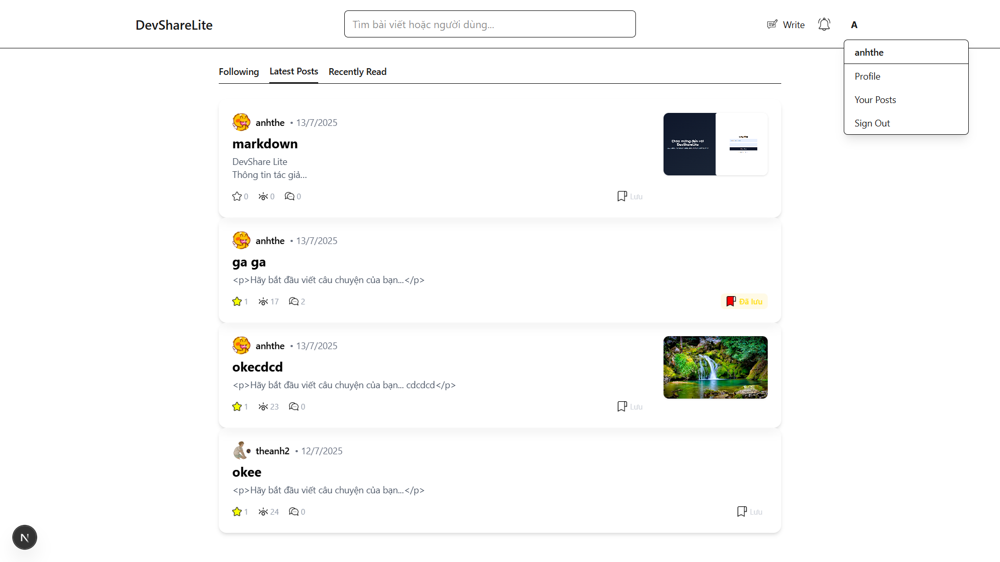
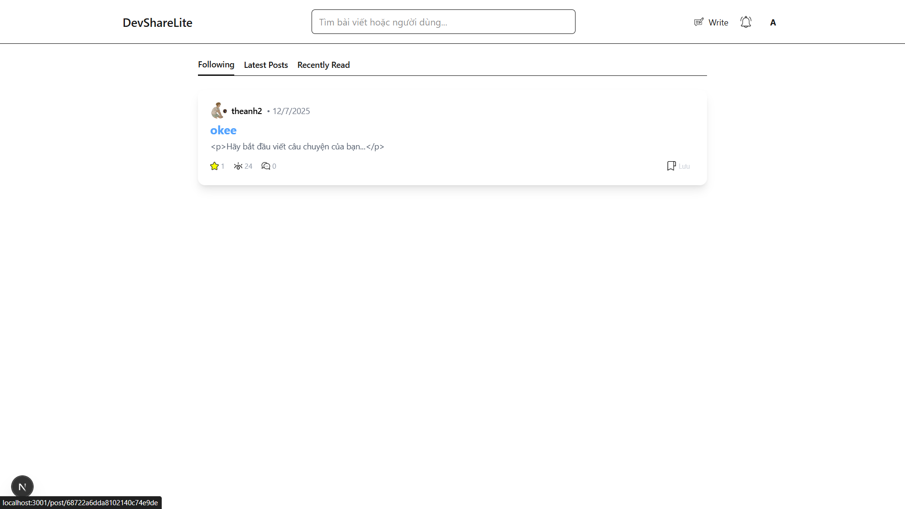
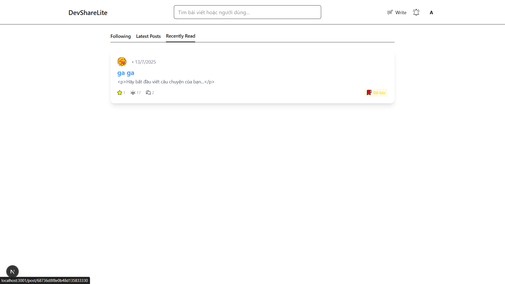
---

## 3.  Viết, chỉnh sửa và xoá bài viết

- Giao diện editor hỗ trợ Markdown (dùng Tiptap hoặc Markdown HTML)
- Cho phép người dùng tạo, chỉnh sửa, và xoá bài viết đã đăng
- Cho phép người dùng xem trước bài viết sẽ được đăng
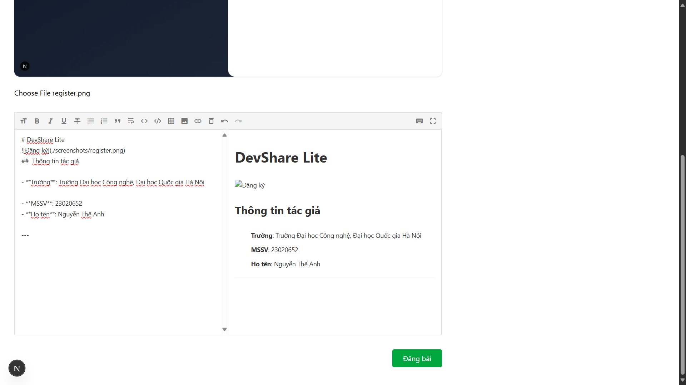
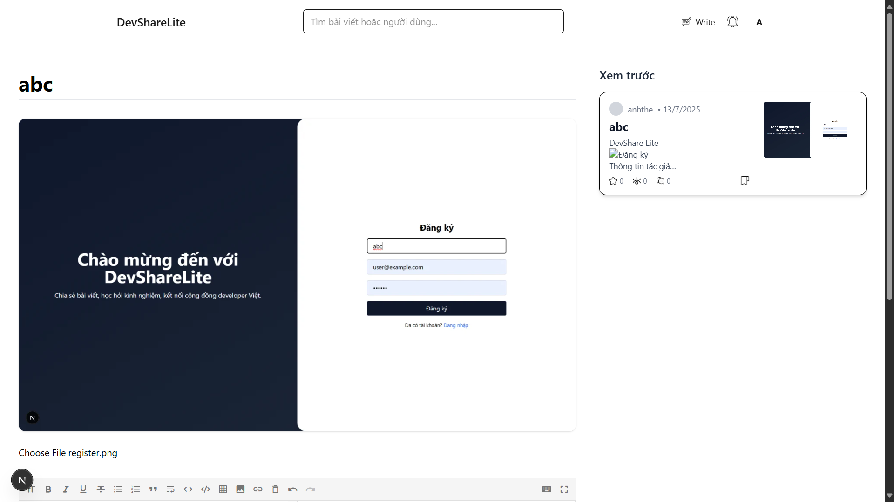

---

## 4.  Chi tiết bài viết

- Hiển thị nội dung định dạng rõ ràng (render Markdown)
- Tính năng: star, bookmark, đếm lượt xem
- Có thể sửa hoặc xóa nếu là bài viết của bản thân
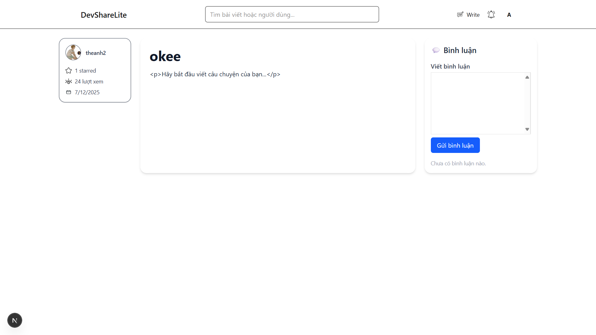
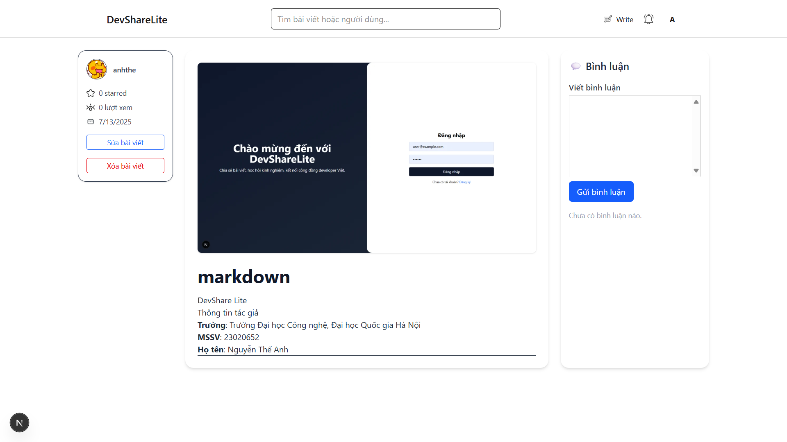
---

## 5.  Bình luận và trả lời bình luận

- Người dùng có thể bình luận bài viết
- Hỗ trợ bình luận lồng nhau (reply bình luận)

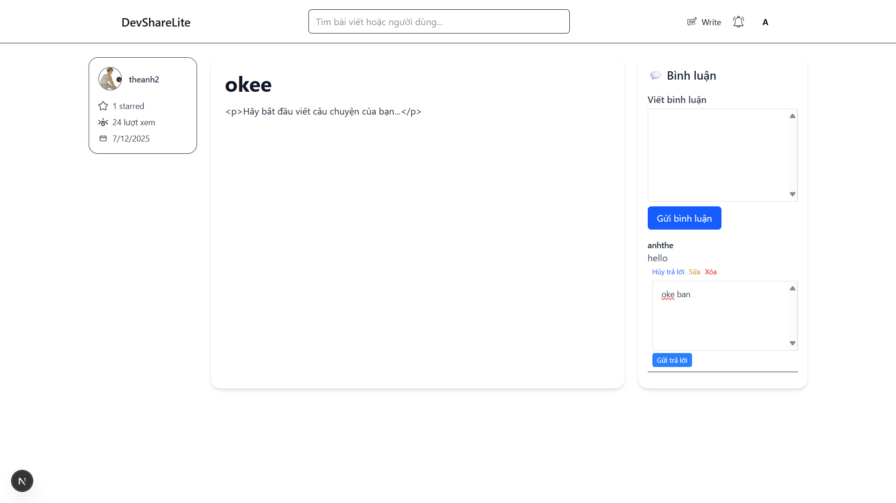

---

## 6.  Đánh dấu (Star), Bookmark bài viết

- Người dùng có thể tương tác với bài viết bằng cách:
  - Đánh dấu (star)
  - Bookmark

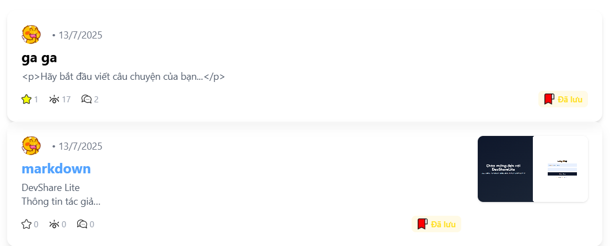

---

## 7.  Hồ sơ cá nhân người dùng

- Hiển thị thông tin người dùng: avatar, bio, bài viết đã đăng
- Cho phép chỉnh sửa avatar, mô tả

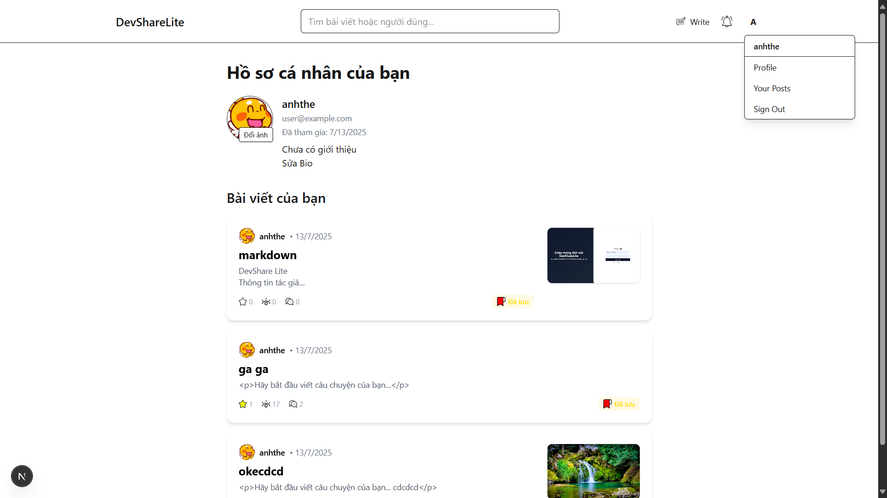

---

## 8.  Theo dõi người dùng khác

- Người dùng có thể theo dõi hoặc bỏ theo dõi người khác
- Tab "Following" hiển thị những bài viết của tác giả được follow

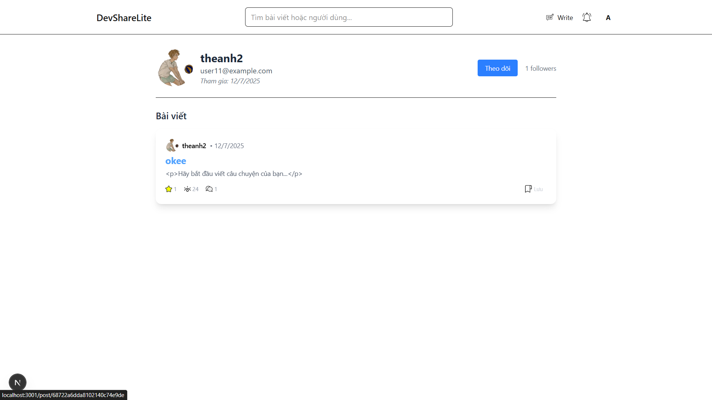

---
## 9. Tìm kiếm nâng cao
- Cho phép tìm kiếm bài viết theo tựa đề
- Tìm kiếm người dùng theo username hoặc email

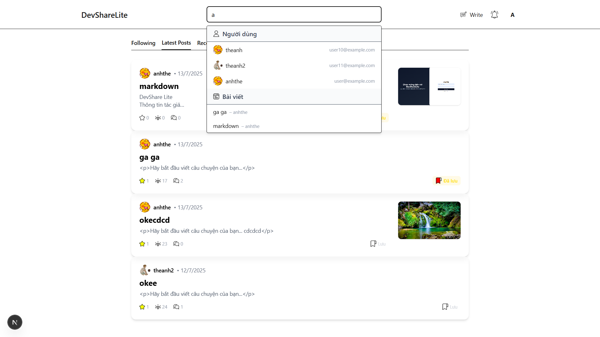

