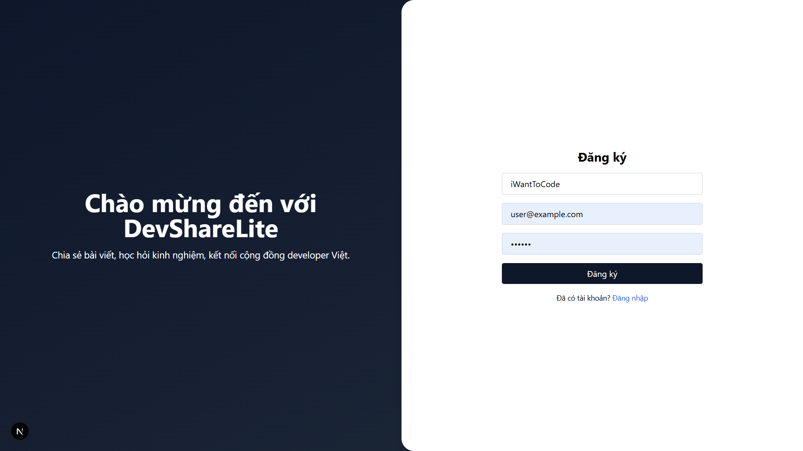

# DevShare Lite

##  Thông tin tác giả

- **Trường**: Trường Đại học Công nghệ, Đại học Quốc gia Hà Nội
 
- **MSSV**: 23020652
- **Họ tên**: Nguyễn Thế Anh

---

##  Tổng quan dự án

**DevShare Lite** là một nền tảng chia sẻ bài viết dành cho lập trình viên, tương tự như Medium hoặc Dev.to. Người dùng có thể:

- Đăng ký và đăng nhập tài khoản
- Tạo, chỉnh sửa và xóa bài viết có định dạng Markdown
- Xem chi tiết bài viết với bố cục thân thiện, dễ đọc
- Đánh sao (star) (tương tự như like) , lưu (bookmark) bài viết
- Bình luận và trả lời bình luận bài viết
- Theo dõi người dùng khác và xem bài viết của người mình theo dõi
- Xem và chỉnh sửa trang hồ sơ cá nhân

---

##  Công nghệ sử dụng

### 🔹 Frontend

- **Next.js (TypeScript)**: Framework React hiện đại, hỗ trợ SSR và tối ưu SEO.
- **Tailwind CSS**: Giúp xây dựng giao diện hiện đại, responsive, nhanh chóng.
- **React Markdown**: Dùng để render nội dung Markdown trong bài viết.

### 🔹 Backend

- **NestJS (TypeScript)**: Framework xây dựng API mạnh mẽ, có cấu trúc rõ ràng theo module.
- **MongoDB (Atlas)**: Cơ sở dữ liệu NoSQL, dễ mở rộng, thích hợp với dữ liệu bài viết linh hoạt.
- **Mongoose**: ODM giúp định nghĩa schema rõ ràng, dễ quản lý dữ liệu.
- **JWT (jsonwebtoken)**: Xác thực và phân quyền người dùng.
- **Bcrypt**: Mã hóa mật khẩu an toàn.
- **Multer**: Middleware để xử lý upload ảnh từ client lên Cloudinary.
- **Cloudinary**: Lưu trữ và phân phối ảnh (avatar, ảnh bìa bài viết) một cách nhanh chóng và tối ưu, hỗ trợ tăng chất lượng ảnh.


---

##  Cấu trúc thư mục dự án

###  `source_code/frontend`

```bash
├── components/         # Các component tái sử dụng: PostCard, ProfileInfo, Editor...
├── pages/              # Các route chính: /write, /profile/[id], /posts/[id]...
├── utils/              # Các hàm bổ trợ 
├── hooks/              # Custom React hooks như useCurrentUser
├── styles/             # File cấu hình Tailwind CSS và style global
├── public/             # Ảnh, icon tĩnh
└── ...
```
###  `source_code/backend`

```bash
├── controllers/     # Các controller độc lập, không thuộc module (nếu có)
├── modules/         # Các module chính: auth, users, posts, comments...
├── schemas/         # Định nghĩa các schema Mongoose (User, Post, Comment...)
├── services/        # Logic nghiệp vụ dùng chung giữa các module
├── strategies/      # Chiến lược xác thực như JWT strategy
├── test/            # Các file kiểm thử (unit test, e2e test)
├── app.controller.ts     # Controller gốc (entry)
├── app.module.ts         # Module gốc, import các module khác
├── app.service.ts        # Service gốc của ứng dụng
├── main.ts               # Điểm khởi động ứng dụng NestJS
└── ...
```
---
##  Hướng dẫn cài đặt và khởi chạy dự án

###  Yêu cầu môi trường
```bash
- Node.js phiên bản 18 trở lên  
- npm phiên bản 9 trở lên  
- Tài khoản MongoDB Atlas  
- Tài khoản Cloudinary  
```
---

###  1. Clone project về máy
```bash
- Tải mã nguồn từ GitHub về bằng lệnh `git clone`  
- Di chuyển vào thư mục `source_code`  
```
---

### 2️. Cài đặt backend
```bash
- Vào thư mục `backend`  
- Cài dependencies bằng `npm install`  
- Tạo file `.env` từ `.env.example`

#### Ví dụ nội dung `.env`:

PORT=3001  
MONGO_URI=mongodb+srv://<username>:<password>@cluster0.mongodb.net/devshare  
JWT_SECRET=your_jwt_secret_key  
CLOUDINARY_CLOUD_NAME=your_cloud_name  
CLOUDINARY_API_KEY=your_api_key  
CLOUDINARY_API_SECRET=your_api_secret  

> Lưu ý: Thay thế `<username>`, `<password>` và các trường thông tin bằng giá trị thực tế của bạn.

- Khởi chạy backend bằng lệnh `npm run start:dev`  
- Mở trình duyệt truy cập `http://localhost:3001` để kiểm tra backend hoạt động
```
---

### 3️. Cài đặt frontend
```bash
- Di chuyển sang thư mục `frontend`  
- Cài dependencies bằng `npm install`  
- Tạo file `.env.local` từ `.env.example`

#### Ví dụ nội dung `.env.local`:

NEXT_PUBLIC_API_URL=http://localhost:3001

- Khởi chạy frontend bằng lệnh `npm run dev`  
- Mở trình duyệt truy cập `http://localhost:3000` để vào giao diện người dùng
```
---

### 4. Kiểm tra kết nối hệ thống
```bash
- Truy cập giao diện người dùng tại `http://localhost:3000`  
- Thử đăng ký / đăng nhập người dùng  
- Viết bài, chỉnh sửa hồ sơ, bình luận, upload ảnh...  
- Xác nhận các chức năng hoạt động đúng với backend
```
---

